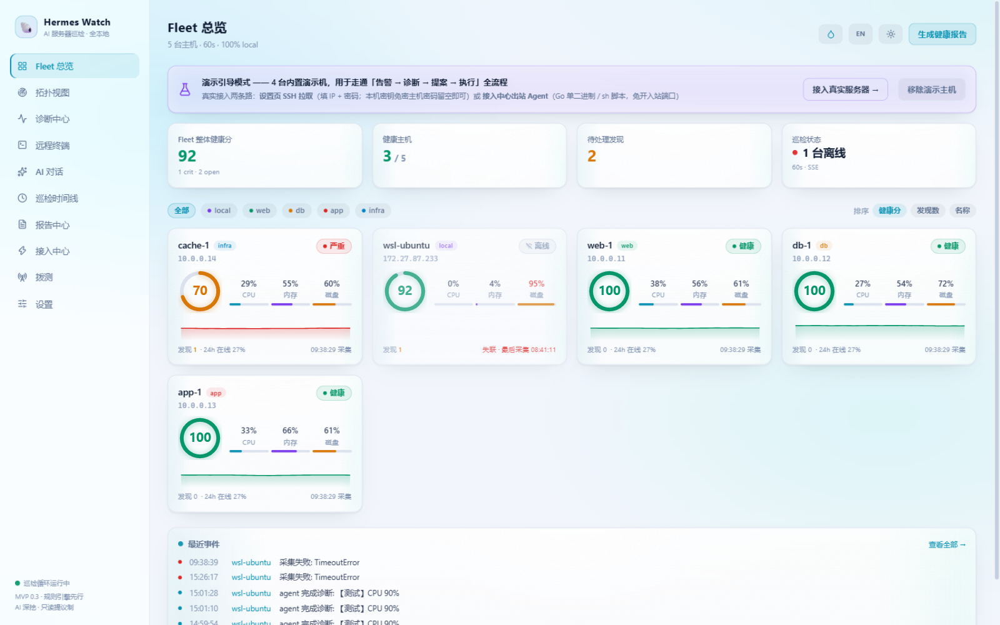
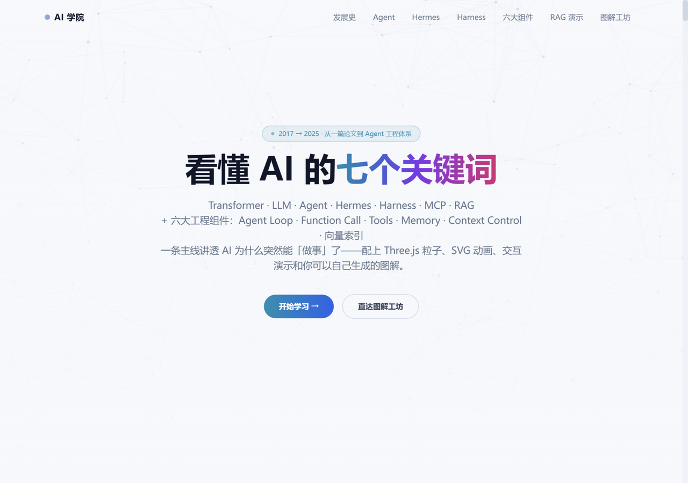
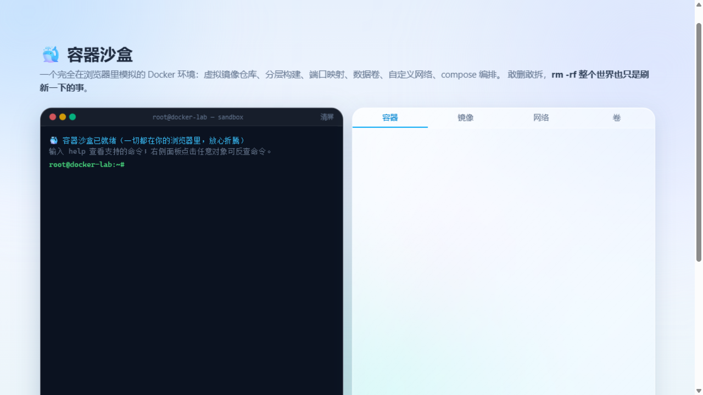
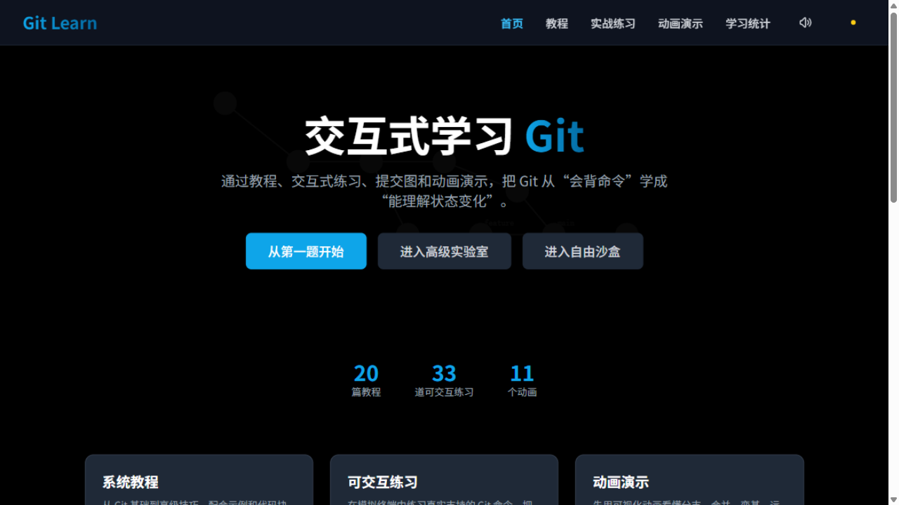
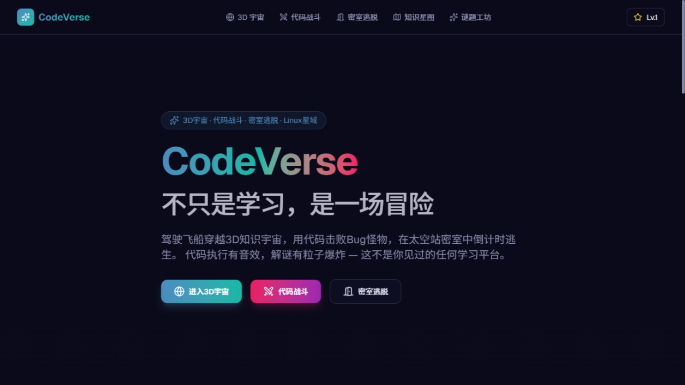
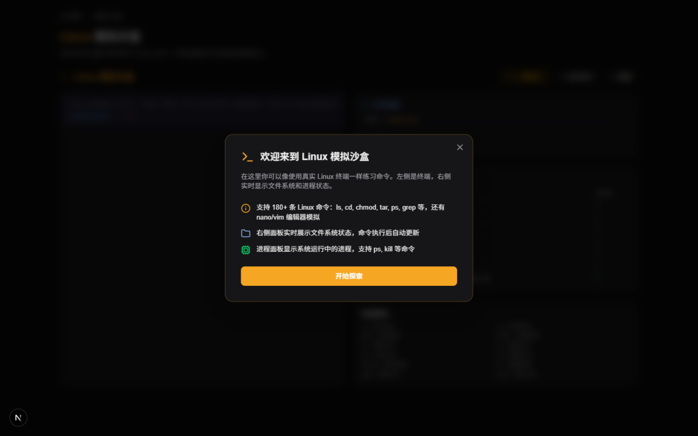

写两类东西：**浏览器里的交互式学习站**，和**本地优先的 AI 工具**（数据不出本机，全部开源）。

## 🚀 精选项目

<table>
  <tr>
    <td width="50%">
      
      <b><a href="https://github.com/StarrySea1412/hermes-watch">Hermes Watch</a></b> 
      AI 服务器巡检平台 —— 规则引擎为主，LLM 只做转述，数据不出本机
    </td>
    <td width="50%">
      
      <b><a href="https://github.com/StarrySea1412/ai-learning-platform">AI 学习平台</a></b> 
      Transformer → LLM → Agent → MCP → RAG，每个概念配可交互演示
    </td>
  </tr>
  <tr>
    <td width="50%">
      
      <b><a href="https://github.com/StarrySea1412/container-learning-platform">容器学习平台</a></b> 
      Docker 正课 + K8s 进阶 + 原理篇，自研浏览器内容器沙盒
    </td>
    <td width="50%">
      
      <b><a href="https://github.com/StarrySea1412/git-learning-platform">Git 学习平台</a></b> 
      动画演示 + 实战练习 + 合并冲突模拟
    </td>
  </tr>
  <tr>
    <td width="50%">
      
      <b><a href="https://gitee.com/starry-sea-1412/python-learning">Python 学习平台</a></b> 
      课程 + Playground + 谜题 + 浏览器内 Python 运行时（Gitee）
    </td>
    <td width="50%">
      
      <b><a href="https://gitee.com/starry-sea-1412/linux-learning-platform">Linux 学习平台</a></b> 
      19 门课 / 78 节 + 170+ 命令的模拟终端沙盒（Gitee）
    </td>
  </tr>
</table>

**还有更多**：[SmartGalleryAI](https://github.com/StarrySea1412/SmartGalleryAI)（本地智能图库，OCR + 语义搜索）· [Hermes Agent Workbench](https://github.com/StarrySea1412/hermes-agent-workbench)（审批门控的 Agent 工作台）· [ProjectPilot](https://github.com/StarrySea1412/utools-project-pilot)（uTools 项目管理插件）· [ClipMaster](https://github.com/StarrySea1412/clipmaster)（剪贴板管理器）· [摄影学习平台](https://gitee.com/starry-sea-1412/photography-learning)

## 🛠 技术栈

  

## 📊 GitHub 数据

  
  

<picture>
  <source media="(prefers-color-scheme: dark)" srcset="https://raw.githubusercontent.com/StarrySea1412/StarrySea1412/output/github-contribution-grid-snake-dark.svg"/>
  
</picture>

